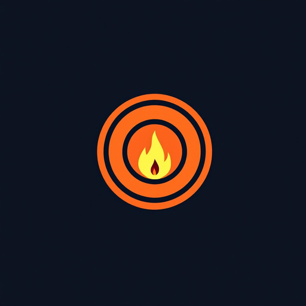
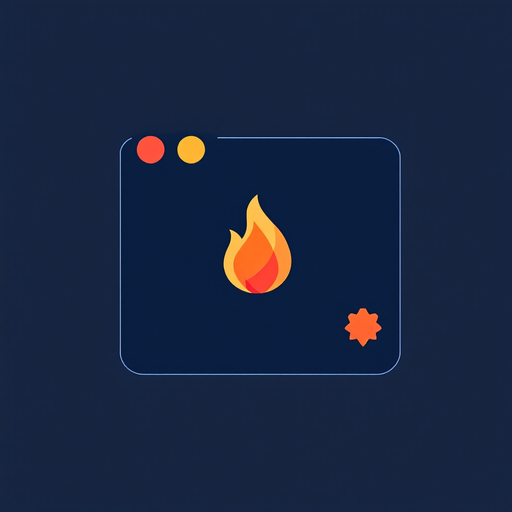
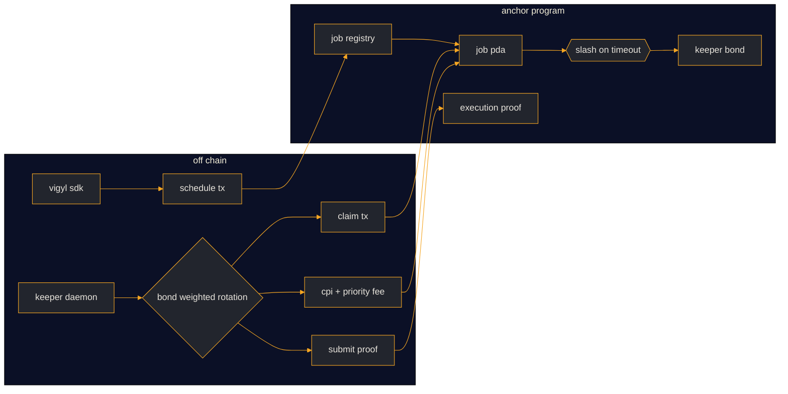

<div align="center">


# VIGYL

**Someone has to keep the light on.**

A general-purpose keeper network for Solana. Job registry, four trigger standards, bonded execution.


[](https://github.com/vigylsignal/vigyl/actions/workflows/ci.yml)
[](https://github.com/vigylsignal/vigyl/commits/main)
[](https://vigyl.cloud)
[](docs/architecture.md)
[](docs/job-spec.md)
[](docs/keeper-spec.md)
[](LICENSE)
[](https://www.rust-lang.org)
[](https://www.anchor-lang.com)
[](https://solana.com)
[](https://www.typescriptlang.org)
[](https://nodejs.org)

<br />






</div>

---

## Overview

Solana programs cannot wake themselves. Vests unlock, positions expire, rewards accrue, oracles cross thresholds -- and someone must send the signature. Since Clockwork sunset in October 2023, every protocol has run its own crank bot. That works, until it doesn't.

VIGYL is a keeper network: a set of on-chain accounts and off-chain daemons that let a protocol register a job (trigger + target instruction + budget), and then have a bonded keeper execute it. If the keeper misses its window, its bond is slashed.

The design maps to what the Ethereum side has already validated -- Chainlink Automation's registry model, Gelato's off-chain executor pattern, Keep3r Network's bonded-worker economy -- specialised for Solana's slot/epoch clock and Pyth pull oracle.

<div align="center">


</div>

## Why

- **Standard vacuum.** Clockwork was the closest thing Solana had to a general-purpose scheduler; the team stepped away citing limited commercial upside, and the mainnet nodes went offline on 2023-10-31. Tuk Tuk (Helium) fills part of the gap as a permissionless crank utility, but there is no bond, no slashing, and no protocol-grade SLA layer sitting on top.
- **Execution guarantees, not just execution.** A trigger without a slash is a suggestion. VIGYL keepers post a bond in `$VIGYL` when they claim work; if the target instruction never lands, the bond is split -- half burned, half paid to the job owner.
- **Four triggers cover the surface.** Time (Vixie cron), account state (data hash diff), price threshold (Pyth pull oracle), and slot/epoch boundaries. That is the union of Chainlink Automation's three triggers and Solana's native scheduling primitive.
- **One-line SDK, one-line daemon.** `vigyl.schedule({ cron, instruction })` for protocols. `vigyl keeper run` for operators.

## Architecture



Boundaries:

- The **Anchor program** owns state: `Config`, `JobRegistry`, `Job`, `KeeperBond`, `ExecutionProof`. It never trusts what a keeper claims; it verifies bond, timeout, and signer.
- The **keeper daemon** owns rotation and CPI construction. It never controls state that isn't its own.
- The **SDK / CLI** wrap the program for protocols and operators.
- The **indexer service** is optional; it mirrors on-chain events into Postgres for the public dashboard. The protocol itself doesn't need it.

## Four triggers

| Trigger | On-chain layout | Off-chain evaluator |
|---|---|---|
| `Cron` (0) | 40-byte Vixie expression + i64 tz offset | `src/trigger/cron.rs` -- range / step / list; `nextRunAt` |
| `AccountState` (1) | 32-byte pubkey + 32-byte hash + `u16 offset` + `u16 len` | `src/trigger/account_state.rs` -- polls or subscribes, `sha256` on the slice |
| `PriceThreshold` (2) | 32-byte Pyth feed + `i64` threshold e6 + direction + confidence + min publish time | `src/trigger/price_threshold.rs` -- pull update via hermes, verify on-chain, compare |
| `SlotEpoch` (3) | `u8` granularity + `u64` period + `u64` last fired | `src/trigger/slot_epoch.rs` -- per-slot or per-epoch |

Each trigger encodes into the same 128-byte fixed buffer inside `Job::trigger_data`. The program treats it as opaque bytes; the keeper decodes and evaluates off-chain, then attaches the resulting instruction on `claim_execution`.

## Bond, rotation, slash

```
1. keeper calls bond_keeper(amount) with amount >= config.min_keeper_bond
2. keeper daemon computes weighted leader:
     seed = sha256(job_pubkey || slot)
     target = u64_le(seed[0..8]) mod sum(bond_amount)
   walk the sorted candidates; first cumulative bond > target is the leader
3. leader calls claim_execution(expected_run_slot)
   program checks slot >= job.next_run_slot and assigned == default
4. leader builds the CPI, applies priority fee, signs, broadcasts
5. leader calls submit_proof(execution_index, tx_signature, success, fee_used)
6. if step 5 never happens within execution_timeout_slots:
   anyone calls slash_keeper(job) -- 50% of bond burned, 50% to job owner
```

The rotation is deterministic per slot, so a losing keeper immediately backs off; there is no race to submit `claim_execution` twice.

## Getting started

The SDK is not on the npm registry yet -- build it from this repo:

```bash
git clone https://github.com/vigylsignal/vigyl
cd vigyl/ts-sdk && npm ci && npm run build   # then `npm link` or a file: dependency
```

```typescript
import { Vigyl } from "@vigyl/sdk";
import { Connection, PublicKey } from "@solana/web3.js";

const vigyl = new Vigyl({
  connection: new Connection("https://api.devnet.solana.com"),
  programId: new PublicKey("HH7mrDz4EUmPaZy8knZxB1SaPL6pvMiZm219YW99WU9o"),
  wallet: myKeypair,
});

const { jobPubkey } = await vigyl.schedule({
  trigger: Vigyl.trigger.cron("0 * * * *"),
  target: {
    program: myProgramId,
    ixData: buildHarvestIx(),
    accounts: myAccounts,
  },
  budgetLamports: 50_000_000n,
  maxPriorityFeeMicroLamports: 5_000n,
});
```

Run a keeper:

```bash
npm install -g vigyl-cli
vigyl keeper bond 1000
vigyl keeper run --max-concurrent 3 --min-fee 3000
```

## Repository layout

```
src/               rust crate -- job types, trigger parsers, rotation, proof, slash
programs/vigyl/    anchor 0.31 program mirroring the on-chain state and instructions
ts-sdk/            @vigyl/sdk client
cli/               vigyl-cli node package (bin: vigyl)
idl/vigyl.json     anchor idl (regenerated from the anchor build)
docs/              architecture, job spec, keeper spec, security notes
examples/          runnable schedule examples (hourly crank, vault rebalance, price threshold)
```

## Documentation

- [docs/architecture.md](docs/architecture.md) -- component boundaries and data flow
- [docs/job-spec.md](docs/job-spec.md) -- JSON schema for a JobSpec and how it encodes into 128 bytes
- [docs/keeper-spec.md](docs/keeper-spec.md) -- keeper daemon boot sequence and failure paths
- [docs/security.md](docs/security.md) -- threat model, overflow policy, priority fee cap

## Prior art

- Clockwork (2022 -- 2023-10-31 sunset). Solana's original scheduling protocol. Nick Garfield stepped away citing opportunity cost and limited commercial upside; on-chain program frozen, code open source. VIGYL borrows Clockwork's thread abstraction and adds the bonded execution layer.
- Tuk Tuk (Helium). A permissionless Solana crank runner that uses PDAs plus bitmaps for task state; the crank-turner binary requires only an RPC url. VIGYL treats Tuk Tuk as the closest existing analogue for the crank runner role, and layers the bond and slash economy on top.
- Chainlink Automation (Ethereum). Custom logic, log, and time-based triggers; Automation Registry contract compensates registered nodes. VIGYL keeps the trigger typology and swaps log triggers for Solana slot/epoch events.
- Gelato Web3 Functions. Cron expression triggers, on-chain event triggers, every-block triggers; decentralised executor network. VIGYL adopts the cron surface and moves the executors on-chain via `KeeperBond`.
- Keep3r Network (Andre Cronje). Bond first, work later; higher bonds unlock more jobs. VIGYL keeps the bonded worker idea and adds a slash to close the "keeper accepted, keeper vanished" gap.
- Pyth Network pull oracle on Solana. `pyth-solana-receiver-sdk` for the on-chain side; `@pythnetwork/hermes-client` and `@pythnetwork/pyth-solana-receiver` off-chain. VIGYL's price-threshold trigger uses the same pull pattern.

## Status

The Anchor program is live on **devnet**. `initialize` has been run, so the config and registry accounts exist and `register_job` / `bond_keeper` can be exercised against the real program today.

| | Address (devnet) |
|---|---|
| Program | [`HH7mrDz4EUmPaZy8knZxB1SaPL6pvMiZm219YW99WU9o`](https://explorer.solana.com/address/HH7mrDz4EUmPaZy8knZxB1SaPL6pvMiZm219YW99WU9o?cluster=devnet) |
| Config PDA | [`AmuWaJAeDm49oXshyLPrCiRjgdePqGQyLSj9x5b85GiB`](https://explorer.solana.com/address/AmuWaJAeDm49oXshyLPrCiRjgdePqGQyLSj9x5b85GiB?cluster=devnet) |
| Job registry PDA | [`6pXMVP3uoB3Fe5fnGVCQSqQy5Yzdk6tKWtCytAko5ywd`](https://explorer.solana.com/address/6pXMVP3uoB3Fe5fnGVCQSqQy5Yzdk6tKWtCytAko5ywd?cluster=devnet) |

[idl/vigyl.json](idl/vigyl.json) is the IDL from the deployed build. Mainnet deployment stays gated on the security notes in [docs/security.md](docs/security.md); until then, point the SDK and CLI at devnet.

## License

Apache-2.0. See [LICENSE](LICENSE).
