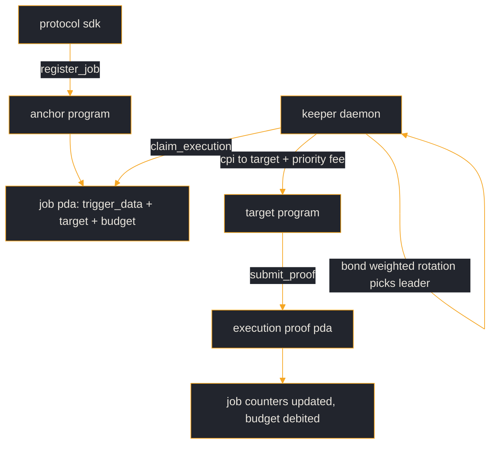

# Architecture

Four moving parts.

1. **Anchor program** (`programs/vigyl`) -- owns state: `Config`, `JobRegistry`, `Job`, `KeeperBond`, `ExecutionProof`. Never trusts what a keeper claims; verifies bond, timeout, and signer on every instruction.
2. **Off-chain crate** (`src/`) -- the trigger encodings (128-byte fixed buffer per Job), the bond-weighted rotation, the execution-proof shape. Same crate is consumed by the daemon and by simulators / auditors.
3. **TypeScript SDK** (`ts-sdk/`) -- protocol-facing. Encodes the trigger, derives PDAs, submits `register_job` transactions.
4. **CLI** (`cli/`) -- operator-facing. Wraps the SDK for both protocol owners and keeper operators; also exposes `vigyl keeper run`.

## Data flow -- one job cycle

## State ownership

| Piece | Reads | Writes |
|---|---|---|
| Anchor program | its own accounts + Sysvars | `Config`, `JobRegistry`, `Job`, `KeeperBond`, `ExecutionProof` |
| Off-chain crate | -- | -- (pure library) |
| SDK | on-chain state via `Program.account.*` | submits transactions |
| CLI | operator wallet, SDK | submits transactions |
| Keeper daemon | all on-chain state visible via RPC + Pyth hermes | submits `claim_execution`, target CPI, `submit_proof`, `slash_keeper` |

## Why the split

Off-chain and on-chain agree on the encoding but disagree on the enforcement. The trigger evaluator is off-chain because Solana doesn't have log triggers -- keepers must observe state changes and hand-craft the target instruction. The bond, the slash, and the execution timeout are on-chain because those are the trust anchors: everything else is best-effort.

## What the indexer is for (and isn't)

`docs/keeper-spec.md` mentions an optional indexer service. Its role is to build the public dashboard (`vigyl.cloud`) and the leaderboard. Protocols and keepers do not need it -- the daemon reads directly from RPC, the SDK reads from the Anchor program.
